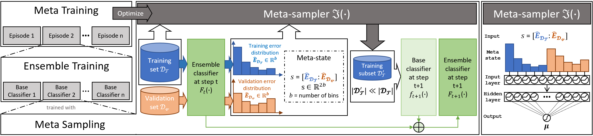
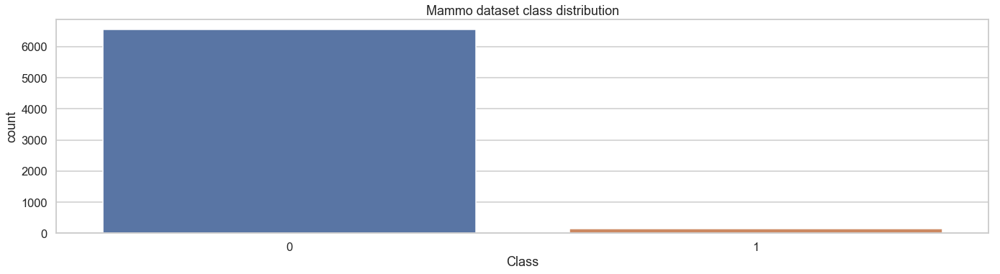
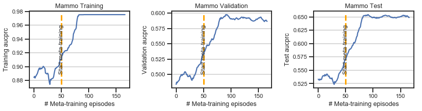
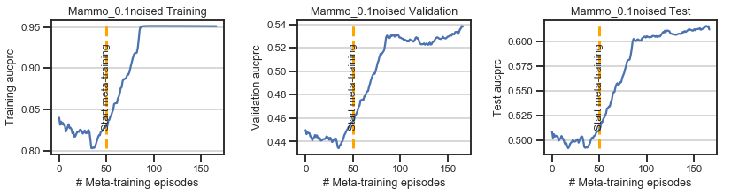
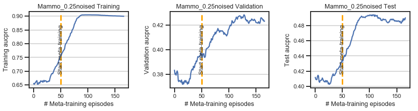
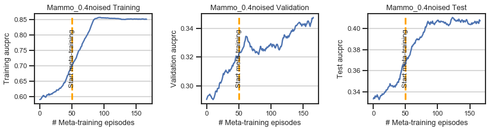
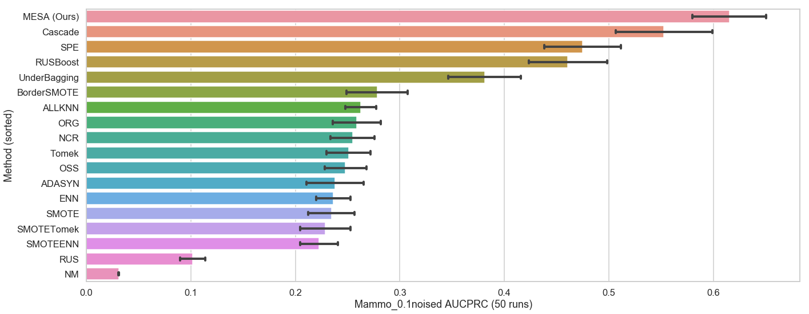
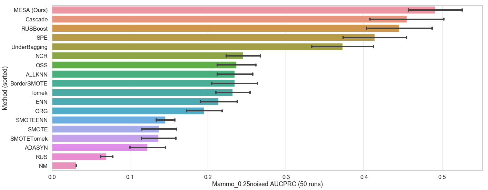
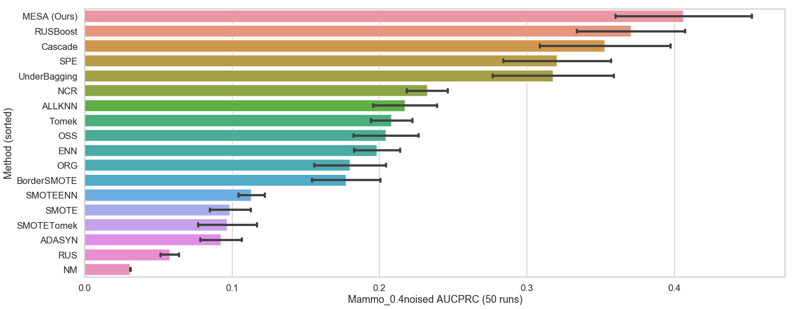

# MESA: Effective Ensemble Imbalanced Learning with MEta-SAmpler
This repository is the official implementation of **MESA: Effective Ensemble Imbalanced Learning with MEta-SAmpler.**

**Main dependencies:**
- [Python](https://www.python.org/) (>=3.5)
- [PyTorch](https://pytorch.org/) (>=1.0.0)
- [pandas](https://pandas.pydata.org/) (>=0.23.4)
- [numpy](https://numpy.org/) (>=1.11)
- [scikit-learn](https://scikit-learn.org/stable/) (>=0.20.1)
- [imbalanced-learn](https://imbalanced-learn.readthedocs.io/en/stable/index.html) (>=0.5.0)
- [jupyter-argparser](https://pypi.org/project/jupyter-argparser/0.0.5/) (>=0.0.5)

To install requirements, run:

```Shell
pip install -r requirements.txt
```

# Table of Contents

- [MESA: Effective Ensemble Imbalanced Learning with MEta-SAmpler](#mesa-effective-ensemble-imbalanced-learning-with-meta-sampler)
- [Table of Contents](#table-of-contents)
- [Background](#background)
- [Usage](#usage)
  - [Running main.py](#running-mainpy)
  - [Running mesa-example.ipynb](#running-mesa-exampleipynb)
- [Results](#results)
    - [Visualize the meta-training process (with 0/10/25/40% noise)](#visualize-the-meta-training-process-with-0102540-noise)
    - [Comparison with baseline methods (with 0/10/25/40% noise)](#comparison-with-baseline-methods-with-0102540-noise)
- [Others](#others)
- [References](#references)


# Background

We introduce a novel ensemble IL framework named MESA. It adaptively resamples the training set in iterations to get multiple classifiers and forms a cascade ensemble model. MESA directly learns a parameterized sampling strategy (i.e., meta-sampler) from data to optimize the final metric beyond following random heuristics. As shown in the figure below, MESA consists of three parts: ***meta sampling*** as well as ***ensemble training*** to build ensemble classifiers, and ***meta-training*** to optimize the meta-sampler.



# Usage

A typical usage example of MESA:

```python
# load dataset & prepare environment
args = parser.parse_args()
rater = Rater(args.metric)
X_train, y_train, X_valid, y_valid, X_test, y_test = load_dataset(args.dataset)
base_estimator = DecisionTreeClassifier()

# meta-training
mesa = Mesa(
    args=args, 
    base_estimator=base_estimator, 
    n_estimators=10)
mesa.meta_fit(X_train, y_train, X_valid, y_valid, X_test, y_test)

# ensemble training
mesa.fit(X_train, y_train, X_valid, y_valid)

# evaluate
y_pred_test = mesa.predict_proba(X_test)[:, 1]
score = rater.score(y_test, y_pred_test)
```

## Running [main.py](https://github.com/NeurIPS2020AnonymousSubmission/mesa/blob/master/main.py)

Here is an example:

```powershell
python main.py --dataset Mammo --meta_verbose 10 --update_steps 1000
```

You can get help with arguments by running:

```powershell
python main.py --help
```

```
optional arguments:
  # Soft Actor-critic Arguments
  -h, --help            show this help message and exit
  --env-name ENV_NAME
  --policy POLICY       Policy Type: Gaussian | Deterministic (default:
                        Gaussian)
  --eval EVAL           Evaluates a policy every 10 episode (default:
                        True)
  --gamma G             discount factor for reward (default: 0.99)
  --tau G               target smoothing coefficient(τ) (default: 0.01)
  --lr G                learning rate (default: 0.001)
  --lr_decay_steps N    step_size of StepLR learning rate decay scheduler
                        (default: 10)
  --lr_decay_gamma N    gamma of StepLR learning rate decay scheduler
                        (default: 0.99)
  --alpha G             Temperature parameter α determines the relative
                        importance of the entropy term against the reward
                        (default: 0.1)
  --automatic_entropy_tuning G
                        Automaically adjust α (default: False)
  --seed N              random seed (default: None)
  --batch_size N        batch size (default: 64)
  --hidden_size N       hidden size (default: 50)
  --updates_per_step N  model updates per simulator step (default: 1)
  --update_steps N      maximum number of steps (default: 1000)
  --start_steps N       Steps sampling random actions (default: 500)
  --target_update_interval N
                        Value target update per no. of updates per step
                        (default: 1)
  --replay_size N       size of replay buffer (default: 1000)

  # Mesa Arguments
  --cuda                run on CUDA (default: False)
  --dataset N           the dataset used for meta-training (default: Mammo)
  --metric N            the metric used for evaluate (default: aucprc)
  --reward_coefficient N
  --num_bins N          number of bins (default: 5). state-size = 2 *
                        num_bins.
  --sigma N             sigma of the Gaussian function used in meta-sampling
                        (default: 0.2)
  --max_estimators N    maximum number of base estimators in each meta-
                        training episode (default: 10)
  --meta_verbose N      number of episodes between verbose outputs. If 'full'
                        print log for each base estimator (default: 10)
  --meta_verbose_mean_episodes N
                        number of episodes used for compute latest mean score
                        in verbose outputs.
  --verbose N           enable verbose when ensemble fit (default: False)
  --random_state N      random_state (default: None)
  --train_ir N          imbalance ratio of the training set after meta-
                        sampling (default: 1)
  --train_ratio N       the ratio of the data used in meta-training. set
                        train_ratio<1 to use a random subset for meta-training
                        (default: 1)
```

## Running [mesa-example.ipynb](https://github.com/NeurIPS2020AnonymousSubmission/mesa/blob/master/mesa-example.ipynb)

Note that running jupyter notebook with `argparse` requires [jupyter-argparser](https://pypi.org/project/jupyter-argparser/0.0.5/) (>=0.0.5) dependency.
We include a dataset [Mammography](https://imbalanced-learn.readthedocs.io/en/stable/generated/imblearn.datasets.fetch_datasets.html#imblearn.datasets.fetch_datasets) and its variants with flip label noise for quick testing and visualization of MESA and other baselines. 
You can use [mesa-example.ipynb](https://github.com/NeurIPS2020AnonymousSubmission/mesa/blob/master/mesa-example.ipynb) to quickly:
- conduct a comparative experiment
- visualize the meta-training process of MESA
- visualize the experimental results of MESA and other baselines

**Please check [mesa-example.ipynb](https://github.com/NeurIPS2020AnonymousSubmission/mesa/blob/master/mesa-example.ipynb) for more details.**

# Results



### Visualize the meta-training process (with 0/10/25/40% noise)






### Comparison with baseline methods (with 0/10/25/40% noise)






# Others

**This repository contains:**
- Implementation of MESA
- Implementation of 7 ensemble imbalanced learning baselines
  - `SMOTEBoost` [1]
  - `SMOTEBagging` [2]
  - `RAMOBoost` [3]
  - `RUSBoost` [4]
  - `UnderBagging` [5]
  - `BalanceCascade` [6]
  - `SelfPacedEnsemble` [7]
- Implementation of 11 resampling imbalanced learning baselines [8]

**NOTE:** The implementations of the above baseline methods are based on [imbalanced-algorithms](https://github.com/dialnd/imbalanced-algorithms) and [imbalanced-learn](https://github.com/scikit-learn-contrib/imbalanced-learn) [8]. 

# References

| #   | Reference |
|-----|-------|
| [1] | N. V. Chawla, A. Lazarevic, L. O. Hall, and K. W. Bowyer, Smoteboost: Improving prediction of the minority class in boosting. in European conference on principles of data mining and knowledge discovery. Springer, 2003, pp. 107–119|
| [2] | S. Wang and X. Yao, Diversity analysis on imbalanced data sets by using ensemble models. in 2009 IEEE Symposium on Computational Intelligence and Data Mining. IEEE, 2009, pp. 324–331.|
| [3] | Sheng Chen, Haibo He, and Edwardo A Garcia. 2010. RAMOBoost: ranked minority oversampling in boosting. IEEE Transactions on Neural Networks 21, 10 (2010), 1624–1642.|
| [4] | C. Seiffert, T. M. Khoshgoftaar, J. Van Hulse, and A. Napolitano, Rusboost: A hybrid approach to alleviating class imbalance. IEEE Transactions on Systems, Man, and Cybernetics-Part A: Systems and Humans, vol. 40, no. 1, pp. 185–197, 2010.|
| [5] | R. Barandela, R. M. Valdovinos, and J. S. Sanchez, New applications´ of ensembles of classifiers. Pattern Analysis & Applications, vol. 6, no. 3, pp. 245–256, 2003.|
| [6] | X.-Y. Liu, J. Wu, and Z.-H. Zhou, Exploratory undersampling for class-imbalance learning. IEEE Transactions on Systems, Man, and Cybernetics, Part B (Cybernetics), vol. 39, no. 2, pp. 539–550, 2009. |
| [7] | Zhining Liu, Wei Cao, Zhifeng Gao, Jiang Bian, Hechang Chen, Yi Chang, and Tie-Yan Liu. 2019. Self-paced Ensemble for Highly Imbalanced Massive Data Classification. arXiv preprint arXiv:1909.03500 (2019). |
| [8] | Guillaume Lemaître, Fernando Nogueira, and Christos K. Aridas. Imbalanced-learn: A python toolbox to tackle the curse of imbalanced datasets in machine learning. Journal of Machine Learning Research, 18(17):1–5, 2017. |